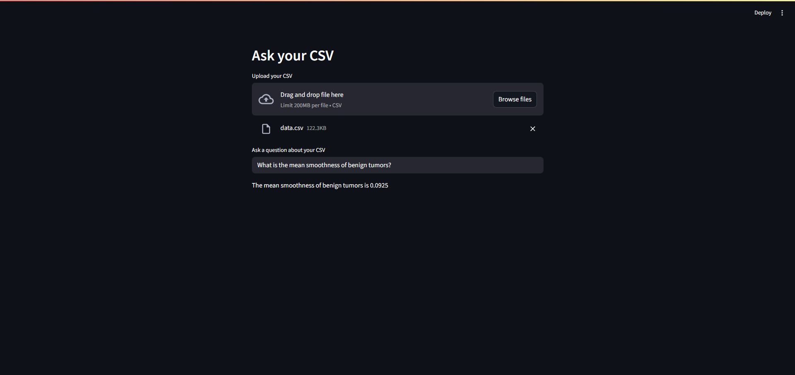
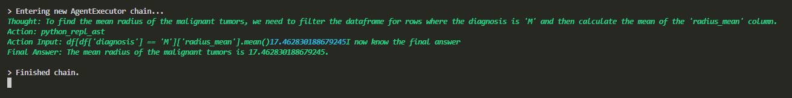

# Langchain CSV Chatbot 🤖📊

This is a Streamlit web app that allows you to **conversationally query CSV files** using natural language powered by LangChain and OpenAI (or Ollama with LLaMA models).

---

## 🔍 Features

- Upload a `.csv` file and ask questions like:
  - "What is the average salary?"
  - "Show me the top 5 highest values"
- Built with:
  - 🧠 LangChain experimental `create_csv_agent`
  - 🗂️ OpenAI via `langchain-openai`
  - 🐍 Python & Streamlit for UI
- Fully deployable to [Streamlit Cloud](https://langchain-csv-chatbot-bnfierdgaskrnx6vammdph.streamlit.app/)

---

## 📁 Project Structure

```text
.
├── .env                  # (Your local API keys, ignored by git)
├── .env.example          # Template for .env with placeholders
├── .gitignore            # Ignores .env, .venv, and other common files
├── main.py               # Main Streamlit app logic
├── result.png            # Screenshot: CSV upload UI
├── result1.png           # Screenshot: Query in action
├── result_backend.png    # Screenshot: Backend terminal response
└── requirements.txt      # Dependencies list for deployment

# 🚀 Getting Started
1. Clone the Repo
```
git clone https://github.com/JOEDUCERR/Langchain-CSV-Chatbot.git
cd Langchain-CSV-Chatbot
```

2. Setup Virtual Environment
```
python -m venv .venv
source .venv/bin/activate  # On Windows: .venv\Scripts\activate
```

3. Install Requirements
```
pip install -r requirements.txt
```
4. Add OpenAI Key
Create a .env file like this:
```
OPENAI_API_KEY=your-openai-api-key
```

💻 Run the App
```
streamlit run main.py
```

# Results:





